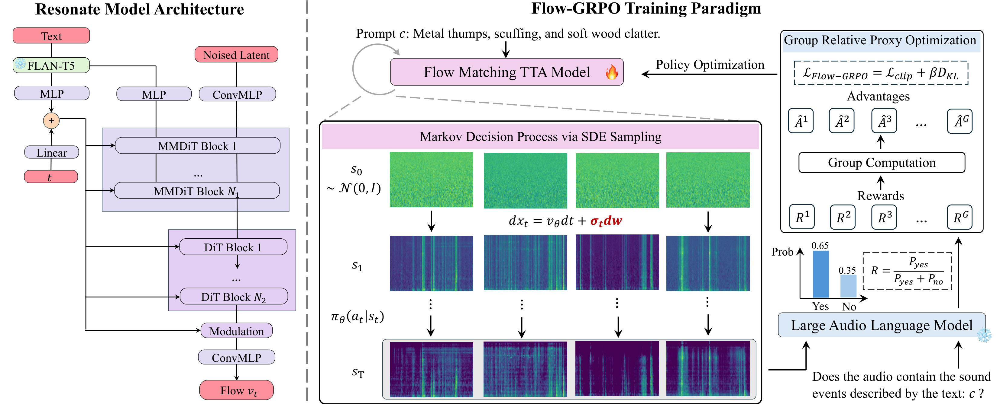

<div align="center">
<p align="center">
  <h2>Resonate: Reinforcing Text-to-Audio Generation with Online Feedbacks from Large Audio Language Models</h2>
  <!-- <a href=>Paper</a> | <a href="https://meanaudio.github.io/">Webpage</a>  -->

  [](https://arxiv.org/abs/2508.06098)
  [](https://huggingface.co/AndreasXi/MeanAudio)
  [](https://huggingface.co/spaces/chenxie95/MeanAudio)
  [](https://meanaudio.github.io/)

</p>
</div>


## Overview 
Reosnate is a SOTA text-to-audio generator reinforced with online GRPO algorithm. 
This repo provides a comprehensive pipeline for audio synthesis, covering Pre-training, SFT, DPO, and GRPO. 

<div align="center">
  
</div>


## Environmental Setup

1. Create a new conda environment:

```bash
conda create -n resonate python=3.11 -y
conda activate resonate
pip install torch torchvision torchaudio --index-url https://download.pytorch.org/whl/cu118 --upgrade
```
<!-- ```
conda install -c conda-forge 'ffmpeg<7
```
(Optional, if you use miniforge and don't already have the appropriate ffmpeg) -->

2. Install with pip:

```bash
git clone https://github.com/xiquan-li/Resonate.git

cd Resonate
pip install -e .
```

<!-- (If you encounter the File "setup.py" not found error, upgrade your pip with pip install --upgrade pip) -->


## Quick Start

<!-- **1. Download pre-trained models:** -->
To generate audio with our pre-trained model, simply run: 
```bash 
python demo.py --prompt 'your prompt'
```
This will automatically download the pre-trained checkpoints from huggingface, and generate audio according to your prompt. 
By default, this will use [Resonate-GRPO](https://huggingface.co/AndreasXi/Resonate/blob/main/Resonate_GRPO.pth). 
The output audio will be at `Resonate/output/`, and the checkpoints will be at `Resonate/weights/`. 


## Training
Before training, make sure that all files from [here](https://huggingface.co/AndreasXi/Resonate/blob/main/Resonate_GRPO.pth) are placed in `Resonate/weights`. 

### GRPO Training


### DPO Training
We rely on [av-benchmark](https://github.com/hkchengrex/av-benchmark) for validation & evaluation. Please install it first before training.

### Pre-training


## Inference

## Evaluation

## Citation


## Acknowledgement

Many thanks to:
- [MMAudio](https://github.com/hkchengrex/MMAudio) for the MMDiT code and training & inference structure
- [MeanFlow-pytorch](https://github.com/haidog-yaqub/MeanFlow) and [MeanFlow-official](https://github.com/Gsunshine/meanflow) for the mean flow implementation
- [Make-An-Audio 2](https://github.com/bytedance/Make-An-Audio-2) BigVGAN Vocoder and the VAE
- [av-benchmark](https://github.com/hkchengrex/av-benchmark) for benchmarking results
